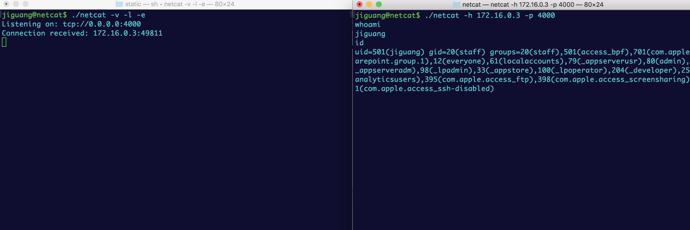
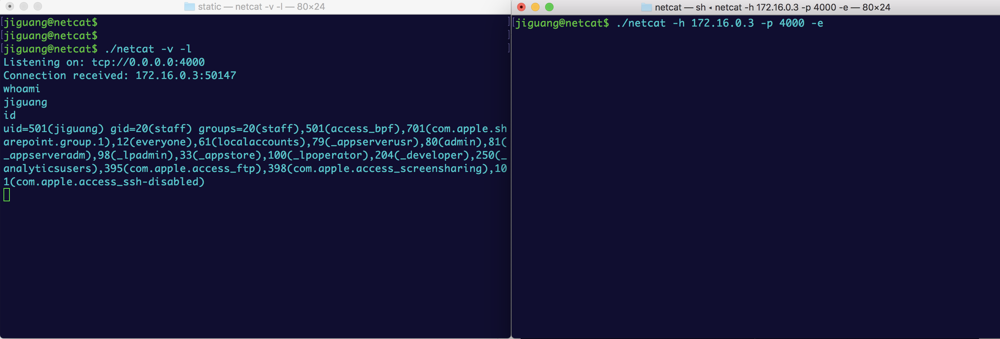
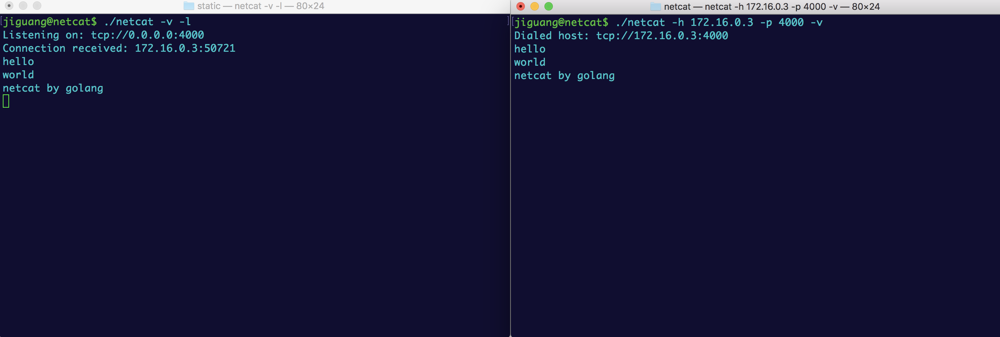
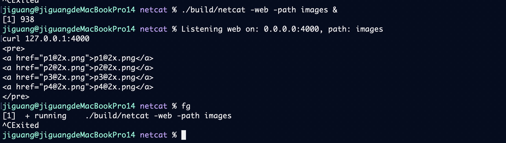

# Netcat

一个功能增强的网络工具，支持正向shell和反向shell，详见下方用法。

---

## 主要用法

### 正向shell（服务端执行命令，客户端控制）

```bash
# 服务端（被控端，执行命令）
./netcat -l -v -e
# 客户端（控制端，输入命令）
./netcat -h 127.0.0.1 -p 4000
```
- 客户端输入命令，服务端执行，结果返回客户端。

### 反向shell（客户端执行命令，服务端控制）

```bash
# 服务端（控制端，输入命令）
./netcat -l -v
# 客户端（被控端，执行命令）
./netcat -h 127.0.0.1 -p 4000 -e
```
- 服务端输入命令，客户端执行，结果返回服务端。


## 快速上手
### 基本用法

```bash
# TCP监听模式
./netcat -l -p 8080

# TCP连接模式
./netcat localhost 8080

# UDP监听模式
./netcat -l -n udp -p 8080

# UDP连接模式
./netcat -n udp localhost 8080
```

### 高级功能

```bash
# 带超时和重试的连接
./netcat -timeout 10s -retries 5 localhost 8080

# SSL加密连接
./netcat -ssl localhost 8443

# SSL监听模式
./netcat -l -ssl -p 8443

# SSL Web服务器
./netcat -web -ssl -p 8443 -path ./public

# 命令模式 (反向shell)
./netcat -l -e -p 8080

# Web静态文件服务器
./netcat -web -p 8080 -path ./public

# 自定义缓冲区大小
./netcat -buffer 8192 localhost 8080
```

---

## 命令行选项
```
name: netcat 
version: 
commit: 
build_tags: 
go: go version go1.21.0 darwin/amd64

usage: netcat [options] [host] [port]

options:
  -p int
        host port to connect or listen (default 4000)
  -help
        print this help
  -v    verbose mode (default true)
  -l    listen mode
  -e    shell mode
  -web  web static server
  -path string
        web static path (default "public")
  -n string
        network protocol (default "tcp")
  -h string
        host addr to connect or listen (default "0.0.0.0")
  -timeout duration
        connection timeout (default 30s)
  -retries int
        connection retry attempts (default 3)
  -ssl  use SSL/TLS
  -keepalive
        enable keep-alive (default true)
  -buffer int
        buffer size for data transfer (default 4096)
```

---

## 场景演示

### 1. 正向命令执行


### 2. 反向命令执行


### 3. 文件传输


### 4. 标准输入输出


### 5. Web静态服务器


## 常见使用场景

### 网络调试
```bash
# 测试端口连通性
./netcat -timeout 5s localhost 80

# 监听端口查看连接
./netcat -l -p 8080
```

### 文件传输
```bash
# 发送文件
cat file.txt | ./netcat localhost 8080

# 接收文件
./netcat -l -p 8080 > received.txt
```

### 反向Shell
```bash
# 服务器端
./netcat -l -e -p 8080

# 客户端连接
./netcat localhost 8080
```

### Web服务
```bash
# 启动静态文件服务器
./netcat -web -p 8080 -path ./public

# 启动HTTPS静态文件服务器
./netcat -web -ssl -p 8443 -path ./public
```

---

## 构建

```bash
# 编译
go build -o netcat main.go

# 交叉编译
GOOS=linux GOARCH=amd64 go build -o netcat-linux main.go
GOOS=windows GOARCH=amd64 go build -o netcat.exe main.go
```

---

## 许可证

MIT License